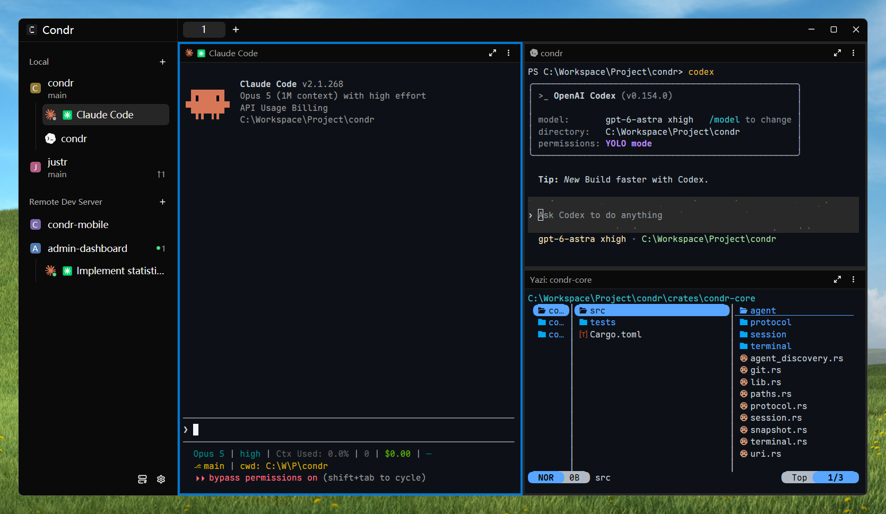

# Condr

<p align="center">
  
</p>

<p align="center">
  <b>让你的 Agent 一直运行</b>
  <br />
  一个窗口，管理所有 Agent。本机和远程一样用，随时离开，随时回来。
</p>

<p align="center">
  <a href="README.md">English</a> · 简体中文
</p>

<p align="center">
  <a href="https://github.com/condrdev/condr/releases"></a>
  <a href="LICENSE"></a>
</p>

<p align="center">
  
</p>

Condr 是一个小巧的桌面应用。它在一个窗口里同时运行 Claude Code、Codex 和其他命令行 Agent，也能运行任何终端程序。

Condr 由两部分组成：

- **Server**：命令 `condr`。它运行所有 Agent，并在后台持续工作。
- **Client**：应用 `condr-gui`。它是你看到的窗口，可以同时连接多个 Server。

## 特性

- **一直运行。** 关闭窗口或断开连接后，Server 和 Agent 继续工作。
- **远程管理。** 在一个窗口里管理本机和远程设备。支持 SSH 和 TCP 两种连接方式。
- **Agent 状态。** 侧栏显示每个 Agent 正在做什么。Agent 完成任务时，Condr 发送通知。
- **Agent 驱动。** Agent 也能操作 Condr：创建窗格、读取输出、分配任务、与其他 Agent 沟通。
- **真实终端。** 每个窗格都是基于 `alacritty` 内核的真实终端，能运行任何命令行程序。
- **快。** 全部用 Rust 编写，不使用 Electron。体积小，响应快，Agent 忙碌时界面不卡顿。

## 安装

> [!WARNING]
> Condr 处于早期开发阶段，每天发布新的 [Nightly](https://github.com/condrdev/condr/releases/tag/nightly) 版本。Client 和 Server 必须使用同一个版本。

### 桌面应用

安装在你使用的电脑上。它已包含 Server，本机使用不需要再安装其他组件。

从 [Releases](https://github.com/condrdev/condr/releases) 下载对应平台的安装包：

| 平台                 | 安装包   |
| -------------------- | -------- |
| Linux x86_64 / arm64 | AppImage |
| macOS x86_64 / arm64 | `.dmg`   |
| Windows x86_64       | `.exe`   |

macOS 应用没有经过 Apple 公证（尚未完成 Apple 开发者账号注册），首次启动会提示无法验证。点 **完成**，打开 **系统设置 › 隐私与安全性**，滚到底部点 **仍要打开**。或者在终端里清除一次下载标记：

```sh
xattr -cr /Applications/Condr.app
```

### Headless Server

安装在你想远程运行 Agent 的设备上。它只包含 `condr` 命令，没有图形界面。

在该设备上运行对应命令：

| 平台                 | 安装命令                                        |
| -------------------- | ----------------------------------------------- |
| Linux x86_64 / arm64 | `curl -fsSL https://condr.dev/install.sh \| sh` |
| macOS x86_64 / arm64 | `curl -fsSL https://condr.dev/install.sh \| sh` |
| Windows x86_64       | `irm https://condr.dev/install.ps1 \| iex`      |

## 连接远程设备

在侧栏点击 **Connect Remote Device**，然后输入远程设备的链接。链接有 SSH、TCP 和 Peer-to-peer 三种格式：已有 SSH 登录用 SSH，远程设备有固定地址用 TCP，两台机器都没有公网地址用 Peer-to-peer。

### SSH

```text
ssh://user@build-box
```

远程设备装好 `condr` 后就能连接。Condr 使用你现有的 OpenSSH 配置和 ssh-agent，不需要额外设置。

### TCP

```text
tcp://<server key>.<invite>@<host>:<port>
```

TCP 监听默认关闭。配对链接由远程设备生成，在该设备上完成以下步骤：

1. 启动 Server 并让它监听网络。如果 Server 已在运行，把 `start` 换成 `restart`。监听地址会保存到配置文件，之后启动不用再加：

   ```bash
   condr server start --listen 0.0.0.0:2637
   ```

2. 运行 `condr server invite`。命令会输出配对链接。
3. 在 10 分钟内把配对链接填入 Condr。如果链接过期，重复第 2 步。

双方使用静态密钥互相验证身份（`Noise_IKpsk2`），连接全程加密。

### Peer-to-peer

```text
p2p://<server key>.<invite>
```

适用于两台都在 NAT 后面的机器，比如家里的台式机和公司的笔记本。不需要有固定 IP，也不用装 VPN。Peer-to-peer 默认关闭，在远程设备上完成以下步骤：

1. 启动 Server 并开启 Peer-to-peer。如果 Server 已在运行，把 `start` 换成 `restart`。设置会保存到配置文件：

   ```bash
   condr server start --p2p
   ```

2. 运行 `condr server invite`。命令会输出配对链接。
3. 在 10 分钟内把配对链接填入 Condr。如果链接过期，重复第 2 步。

两台设备能直连就直连，不能直连时经 Condr 的中继转发。在两台设备之间的连接使用密钥端到端加密，中继看不到你的传输内容。中继是 Condr 唯一的托管服务，不使用 Peer-to-peer 的设备不会连接它。中继能看到和看不到什么，见 [SECURITY.md](SECURITY.md)。

## 开发

```bash
git clone https://github.com/condrdev/condr
cd condr
cargo build
cargo run -p condr-gui                   # 需要显示器（Windows / macOS / Linux 桌面）

cargo fmt --all -- --check
cargo clippy --workspace --all-targets --features condr-gui/test-support -- -D warnings
cargo test --workspace --features condr-gui/test-support
```

## 许可证

[Apache License 2.0](LICENSE)
