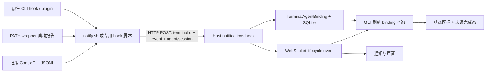

# Superset 的 Agent 状态监测

调查日期：2026-09-11。源码固定在 Superset commit [`cd331568d3b26bfea127fb6db2afe2075a50f06b`](https://github.com/superset-sh/superset/commit/cd331568d3b26bfea127fb6db2afe2075a50f06b)，提交时间 2026-09-10T22:58:34-07:00；只读 checkout 为 `/tmp/condr-superset-research`。以下讨论终端内原生 Agent CLI 的集成；内置 Chat 的 SDK/harness 状态是另一条链路。

**结论：Superset 主要使用 CLI 自身的 hooks / plugin 事件，加上启动 wrapper，把状态通过 HTTP 上报 Host，再由 GUI 派生 working、permission、review、failed、idle。当前主链路不靠终端屏幕文本分类。Codex 还保留针对旧版本的专属 TUI JSONL watcher；GUI 也有按 Escape / Ctrl+C 清状态的补偿，因此不能把它概括为严格“只接受原生 hooks”。** [适配入口][setup]、[统一事件][mapping]、[Codex wrapper][codex-wrapper]、[中断补偿][interrupt]

## 从 CLI 到界面

1. **安装与注入。** Electron 和独立 Host 都调用共享的 `setupAgentIntegrations()`：创建 Superset 私有 `bin/`、`hooks/` 以及 shell 集成，按 agent 注册 hooks / plugins。全局配置中的公共命令在运行时解析 `$SUPERSET_HOME_DIR/hooks/notify.sh`，兼容不同 Superset 安装目录；外部终端没有相关环境变量时不发送事件。[初始化][setup]、[公共命令][wrapper]
2. **识别终端与 Agent。** 事件携带 `SUPERSET_TERMINAL_ID`；wrapper 首次设置 `SUPERSET_AGENT_ID`，hook 配置再标记 `SUPERSET_HOOK_HARNESS`。两者不一致时丢弃事件，防止 Claude 调用 Codex，或 Cursor 重放 Claude 配置时，把父终端错误重绑定成另一个 Agent。[身份过滤][notify]
3. **提前绑定图标。** wrapper 后台等 2 秒，确认进程还活着后发送 `SessionStart`，避免 Codex 尚未收到首个 prompt 时无 hook、界面没有 agent 图标。`--help` / `--version` 等探测跳过报告。这是启动报告，不代表开始执行任务。[启动报告][launch-report]
4. **上报。** 公共 `notify.sh` 从 stdin 或 argv 读取 CLI JSON，提取事件、原生会话 ID，向 `/trpc/notifications.hook` POST。先用继承的 URL，失败或目标不拥有该终端时再读取 `~/.superset/host/*/manifest.json` 的当前 endpoint，解决 Host 重启换端口后旧 Agent 环境变量过期的问题；请求有连接/总时限。v2 未送达时还保留 Electron v1 `/hook/complete` 回退。[发送与重发现][dispatch]
5. **Host 权威绑定。** Host 按 terminal ID 查出所属 workspace，映射事件，使用收到事件时的 `Date.now()`，广播 `agent:lifecycle` 并记录 `TerminalAgentBinding`。binding 保存 agent ID、原生 session ID、最近事件与时间；持久化在 SQLite。延迟到达的同会话 `Attached` 保留既有工作状态，结束后的 30 秒窗口阻止部分旧事件复活 binding。[接收端][host-hook]、[binding][binding]、[持久化][persistence]
6. **GUI 呈现。** WebSocket 的 lifecycle / bindings-changed / terminal lifecycle 事件使 binding 查询失效并刷新。`staleTime: 30_000` 是数据新鲜度，并非每 30 秒轮询状态；失联后的 focus/remount 可以重新读取 Host。[订阅与查询][binding-query]

这里的 HTTP hook 是 `publicProcedure`，不要求普通客户端认证；接收端以终端记录决定归属。环境变量门禁和 harness 身份判断用于正确归属，不是加密身份认证。[接收端][host-hook]、[身份过滤][notify]

## 统一事件与 GUI 状态

| 统一事件 | 典型原生来源 | GUI / binding 的行为 |
| --- | --- | --- |
| `Attached` | `SessionStart` | 建立 agent 绑定；已有同会话状态不被启动报告覆盖 |
| `Detached` | `SessionEnd` | 结束绑定，不作为一轮任务完成 |
| `Start` | `UserPromptSubmit`、`PostToolUse`、`PostToolUseFailure`、`PermissionResult` | `working`；工具返回后从等待态恢复 |
| `PermissionRequest` | 权限请求、某些专用问答 hook、`Notification` / `PreToolUse` 别名 | `permission`，看过终端也不会自动消失 |
| `Stop` | `Stop`、`Interrupt`、部分 CLI 的 turn-end | 未看过本次结束时 `review`，已看过时 `idle` |
| `Failed` | `StopFailure` | `failed`，区别于正常完成 |

映射表是 Host 的公共逻辑；具体 CLI **并不全部注册这些事件**，不能根据 Host 支持某个别名推断该 CLI 有完整覆盖。[统一事件][mapping]、[GUI 派生][derive]

`review` 是“这一轮结束了，用户尚未看过”的呈现：比较 `lastEventAt` 和客户端 `lastSeenAt`；不是 Agent 的原生状态。无 binding / 不属于上述状态的情况显示 `idle`，没有 Condr 的 `Unknown` 语义。通知层排除 `Start` / `Attached` / `Detached`，其余 `Stop` / `PermissionRequest` / `Failed` 可通知；当前终端可见且窗口聚焦时抑制提醒。[GUI 派生][derive]、[通知处理][notification-ui]

## 已实现的 14 种 CLI 适配

下表中的箭头右侧为统一事件；路径是默认配置位置，部分支持独立 profile。它描述该 commit 实际注册的事件，不保证所有 CLI 当前版本都能触发。

| Agent | 安装位置 / 方式 | 事件覆盖与特例 |
| --- | --- | --- |
| Claude Code | 合并 `~/.claude/settings.json` | SessionStart/End；UserPromptSubmit、PostToolUse、PostToolUseFailure → Start；PermissionRequest；Stop；StopFailure → Failed；SubagentStart/Stop 单独分流。[源码][claude-hooks] |
| Codex | 合并 `~/.codex/hooks.json` + wrapper | SessionStart/End、UserPromptSubmit、Stop、Interrupt；仅 `request_user_input` 的 Pre/PostToolUse → PermissionRequest/Start；SubagentStart/Stop。另有旧版 TUI JSONL 兼容。[源码][codex-hooks] |
| OpenCode | Superset 私有 `hooks/opencode/plugin/superset-notify.js`；wrapper 设置 `OPENCODE_CONFIG_DIR` | session created/deleted → Attached/Detached；busy/idle/error → Start/Stop；permission.asked、question.asked → PermissionRequest；过滤 child sessions。[插件][opencode-plugin]、[安装][opencode-install] |
| Droid | 合并 `~/.factory/settings.json` | SessionStart/End、UserPromptSubmit、Stop、PostToolUse；Notification → PermissionRequest。[源码][droid] |
| Cursor Agent | 合并 `~/.cursor/hooks.json` + 专用 shell hook | beforeSubmitPrompt → Start；stop → Stop；beforeShellExecution / beforeMCPExecution → PermissionRequest；Shell/MCP 的 postToolUse / Failure → Start；SessionStart/End。[源码][cursor] |
| Gemini CLI | 合并 `~/.gemini/settings.json` + 专用 shell hook | BeforeAgent / AfterTool → Start；AfterAgent → Stop；SessionStart/End；未注册权限等待事件。脚本先输出 `{}` 满足 hook 协议。[注册][gemini-config]、[适配][gemini] |
| Mastra Code | 合并 `~/.mastracode/hooks.json`，事件直接位于 JSON 根 | SessionStart/End、UserPromptSubmit、Stop、PostToolUse；没有独立权限/失败 hook。[源码][mastra] |
| Kimi Code | `~/.kimi-code/config.toml` 的受管 `[[hooks]]` 块 | SessionStart/End、UserPromptSubmit、PostToolUse / Failure、PermissionRequest / Result、Stop / StopFailure、Interrupt；支持 `KIMI_CODE_HOME`。[源码][kimi] |
| Grok | `~/.grok/hooks/superset-notify.json` + config 中关闭 Claude/Cursor hooks 重放 | SessionStart/End、UserPromptSubmit、PostToolUse / Failure、Stop / StopFailure；只让 Notification 的 permission_prompt / elicitation_dialog 进入 PermissionRequest。[源码][grok] |
| GitHub Copilot CLI | wrapper 在工作目录写 `.github/hooks/superset-notify.json` | **实际注册** sessionStart/End、userPromptSubmitted、postToolUse；没有独立 turn Stop，也没有注册 preToolUse，尽管 shell adapter 能处理后者。[源码][copilot] |
| Amp | `~/.config/amp/plugins/superset-lifecycle.ts` | session.start → Attached；agent.start → Start；agent.end → Stop；原生会话 ID 同时作为 resourceId/session_id 发送。[安装][amp-config]、[事件][amp] |
| Pi | `~/.pi/agent/extensions/superset-hooks.ts` | session_start/end；before_agent_start → Start；tool_execution_end → Start；agent_end / session_shutdown → Stop；`ctx.hasUI === false` 跳过非交互子进程。[安装][pi-config]、[事件][pi] |
| Oh My Pi | `~/.omp/agent/extensions/superset-hooks.ts`，支持 `OMP_CODING_AGENT_DIR` | 类似 Pi，主要 turn-start 为 agent_start，兼容 before_agent_start；同样按 hasUI 过滤。[安装][omp-config]、[事件][omp] |
| Mistral Vibe | `~/.vibe/hooks.toml` 的受管块；wrapper 开 experimental hooks | before_tool → Start；post_agent_turn → Stop。没有原生 session hook，启动图标由 wrapper 的报告补齐。[源码][vibe] |

JSON 配置安装会先删掉已识别的 Superset 旧条目，再加入当前条目，保留用户其它设置；无法解析的配置跳过，避免覆盖。独占 plugin 文件使用签名识别，TOML 使用受管区块；用户禁用集成后执行各 agent 的 teardown。Claude/Codex 的独立配置目录也有对应安装入口。[JSON 合并][json-merge]、[setup/teardown 注册][setup-definitions]、[profile 安装][profile-hooks]

## Codex：原生 hooks 为主，JSONL 为兼容

当前代码明确以原生 hooks 作为稳定的生命周期入口；旧版本 watcher 只作 best effort。wrapper 执行 CLI 时加 `--enable hooks`，且缺省补上 `--dangerously-bypass-hook-trust`，避免未信任的 Stop hook 被静默跳过。这是 Superset 当前产品的启动策略，不能将它理解成原生 hooks 必须绕过 trust 才能使用。[注册策略][codex-hooks]、[启动参数][codex-wrapper]

兼容 watcher 设置 `CODEX_TUI_RECORD_SESSION=1` 和本进程独有的 `CODEX_TUI_SESSION_LOG_PATH`，等待文件出现，然后 tail：`from_tui + op + UserTurn` → Start；含 `_approval_request` 的日志行 → PermissionRequest。**它不扫描全局 `~/.codex/sessions/rollout-*.jsonl`，也不从这个 watcher 推导 Stop**，避免并发 Codex 会话互相串状态。[watcher][codex-wrapper]

公共 notify 脚本仍可识别 legacy `agent-turn-complete` → Stop、`thread-id` → 原生可恢复会话 ID；但当前 wrapper **不再注入 `notify=`**，原因是 legacy 回调无法区分主 agent 与子 agent 的完成。正常退出时 wrapper 还补一次 SessionEnd；信号导致的退出不补，保留原生会话恢复候选。[legacy 解析][notify]、[不注入与退出处理][codex-wrapper]

## 子 Agent 隔离与 OpenCode 的会话归属

Claude/Codex hook payload 的 `agent_id` / `agentId` 被解释为子 Agent 身份。带此字段的事件发送到 Host 的独立 subagent roster，不进入父终端生命周期、完成提醒或原生 session 绑定；还携带 transcript 路径以便跟踪子任务。跨不同 harness 的嵌套 CLI 则由环境身份不匹配直接过滤。[分流][subagents]

OpenCode 使用 **backend plugin 的事件总线**，不是 Condr ADR 0014 现在采用的 TUI plugin。它查 `client.session.list()` 的 `parentID` 并缓存；查不到或查询失败时先忽略，避免把尚未查到的子会话当 root。对选定 root，仅 idle→busy 发 Start、busy→idle 发 Stop，避免重复 idle / error 事件刷通知；事件处理排队以保留本插件内的顺序。[root 验证与去重][opencode-plugin]

**归属边界（由代码推断）：** OpenCode 插件没有读取 TUI 当前路由。首次 root 事件建立归属；空闲后新的 busy root 被认为是会话切换。它能防止已知 child 或其它 root 的普通事件抢走当前绑定，但无法仅凭 backend bus 证明那个 root 正是当前 Pane 正显示的会话。若 Condr 需要恢复“当前显示的 Agent Conversation”，现有 TUI 路由方案证据更直接。[切换逻辑][opencode-plugin]、[Condr ADR 0014](../adr/0014-agent-status-comes-from-hooks-over-osc-777.md)

## 需要区分的补偿和局限

- **按键清状态不是完成证据。** v2 Terminal 在 binding 为 Start / PermissionRequest 时，捕获 Escape 或 Ctrl+C 后调用 Host 的 silent clear。推断：CLI 可能把该按键解释为关弹窗、取消局部操作等，因此显示空闲不必然意味着 Agent 已结束这一轮。[按键处理][interrupt]、[Host clear][clear-status]
- **等待状态的精度因 agent 而异。** Codex 对 `request_user_input` 做精确工具匹配；Grok 过滤 Notification 子类型。Cursor 则把 Shell/MCP 执行前 hook 当成 PermissionRequest，同时输出 `{"continue":true}` 继续 hook，所以该状态也可能只是短暂的工具执行前阶段。[Codex][codex-hooks]、[Grok][grok]、[Cursor adapter][cursor-adapter]
- **OpenCode 的等待恢复存在缺口。** permission.asked / question.asked 发 PermissionRequest 后，插件自己的 `currentState` 仍为 busy；没有处理 permission.replied / question.replied，后续 busy 又会被去重。由此推断，界面的等待标记可能延续到 Stop，而不是回答后立即恢复 working。另外 session.error 被映射成 Stop，未进入 Failed。[插件状态与事件处理][opencode-plugin]
- **HTTP 是尽力发送。** 超时后 hook 不阻断主 agent，也没有持久发送队列；Host 以到达时间记事件，没有原生序号去解决所有跨 hook 进程的乱序。manifest 重发现、延迟 Attached 保留状态、结束后 30 秒过滤各解决特定问题，不等于可靠有序事件流。[发送][dispatch]、[Host][host-hook]、[binding][binding]
- **终端退出与 Agent 退出是两件事。** live binding 查询只返回终端记录仍 active、binding 尚未结束的记录；PTY exit / daemon sweep 会清理已死终端的绑定。但这不等于检测每个 Agent 子进程死亡：若 Agent 没发结束事件、外层 shell 仍活着，状态仍可能卡住。[live 查询][persistence]
- **支持列表不等于完整状态协议。** 例如当前 Copilot 配置没有 turn-end，Vibe 从 before_tool 才拿到 Start，Pi/OMP 模板未附带原生 session ID。静态调查能确认适配代码，无法证明不同 CLI 版本、Shell 和 OS 上全部正常运行。[Copilot][copilot]、[Vibe][vibe]、[Pi][pi]、[OMP][omp]

## 对 Condr 的启示

以下是设计判断，不是 Superset 已经保证的性质，也不改变 Condr 现有 ADR。

1. **现有 hooks 方向得到同类实现印证。** 原生事件进入统一状态、完成的未读标记留给 GUI，和 Condr ADR 0014 的职责划分一致。Superset 的失败态与各 CLI 细分事件表可以作为后续能力清单参考。[统一映射][mapping]、[Condr ADR 0014](../adr/0014-agent-status-comes-from-hooks-over-osc-777.md)
2. **区分进程存在、正在工作、会话结束、回合完成。** Superset 已用 Attached/Detached 与 Start/Stop 分开；Condr 用进程发现提供 Agent 身份和 Unknown，继续避免把“刚启动”判为 Working。[启动报告][launch-report]、[统一事件][mapping]
3. **优先借鉴隔离和测试场景。** 跨 harness 嵌套、Claude/Codex subagent 事件分流、OpenCode root/child 与切换、重复 Stop、延迟启动报告都值得覆盖；无需照搬其多条 shell HTTP 分发路径。[身份与子任务][notify]、[OpenCode][opencode-plugin]
4. **保留 Condr 已选择的传输边界。** Superset 用 env 中的 terminal ID + HTTP 找 Host；Condr 的 OSC 777 绑定 PTY，并与终端输出同序。为了借鉴状态语义，无需引入 HTTP endpoint、端口重发现或按键猜状态；后者与 ADR 0014 的严格 hook 来源原则冲突。[上报][dispatch]、[中断补偿][interrupt]、[Condr ADR 0014](../adr/0014-agent-status-comes-from-hooks-over-osc-777.md)

## 证据、验证和许可证范围

研究依据是上述固定 commit 的实现及现有测试，不以仓库根 `HOOKS_INVESTIGATION.md` 之类历史调查代替当前代码。已阅读事件映射与 GUI 状态派生的测试；本环境 PATH 无 Bun，未执行上游测试。此次未运行 Superset 安装脚本、未启动真实 Agent CLI、未修改其配置；静态核查不等于端到端验收。

已核对所读的 `packages/agent-setup/src/`、`templates/`、Host 状态/通知文件和 GUI 对应文件：未发现这些文件有独立 SPDX、许可证头或更宽松的单文件授权；仓库根许可证为 **Elastic License 2.0（ELv2）**。OpenCode plugin 注释还引用其上游通知实现，但注释引用本身没有给予该 Superset 文件其它许可证。`packages/sdk` 的独立许可证不适用于这里所研究的目录；`DESKTOP_NOTICES.md` 是产品公告说明，不是第三方版权清单。本次只记录机制与永久源码链接，不移植代码；后续用于 Apache-2.0 的 Condr 时应基于原生 CLI API 独立实现，并继续按具体文件核对来源和授权。[仓库许可证][license]、[OpenCode 文件头][opencode-plugin]

[setup]: https://github.com/superset-sh/superset/blob/cd331568d3b26bfea127fb6db2afe2075a50f06b/packages/agent-setup/src/index.ts#L25-L60
[mapping]: https://github.com/superset-sh/superset/blob/cd331568d3b26bfea127fb6db2afe2075a50f06b/packages/host-service/src/events/map-event-type.ts#L1-L97
[wrapper]: https://github.com/superset-sh/superset/blob/cd331568d3b26bfea127fb6db2afe2075a50f06b/packages/agent-setup/src/agent-wrappers-common.ts#L21-L35
[launch-report]: https://github.com/superset-sh/superset/blob/cd331568d3b26bfea127fb6db2afe2075a50f06b/packages/agent-setup/src/agent-wrappers-common.ts#L161-L241
[notify]: https://github.com/superset-sh/superset/blob/cd331568d3b26bfea127fb6db2afe2075a50f06b/packages/agent-setup/templates/notify-hook.template.sh#L7-L114
[dispatch]: https://github.com/superset-sh/superset/blob/cd331568d3b26bfea127fb6db2afe2075a50f06b/packages/agent-setup/templates/notify-hook.template.sh#L138-L264
[subagents]: https://github.com/superset-sh/superset/blob/cd331568d3b26bfea127fb6db2afe2075a50f06b/packages/agent-setup/templates/notify-hook.template.sh#L190-L199
[host-hook]: https://github.com/superset-sh/superset/blob/cd331568d3b26bfea127fb6db2afe2075a50f06b/packages/host-service/src/trpc/router/notifications/notifications.ts#L91-L200
[binding]: https://github.com/superset-sh/superset/blob/cd331568d3b26bfea127fb6db2afe2075a50f06b/packages/host-service/src/terminal-agents/store.ts#L149-L231
[persistence]: https://github.com/superset-sh/superset/blob/cd331568d3b26bfea127fb6db2afe2075a50f06b/packages/host-service/src/terminal-agents/persistence.ts#L353-L405
[binding-query]: https://github.com/superset-sh/superset/blob/cd331568d3b26bfea127fb6db2afe2075a50f06b/apps/desktop/src/renderer/hooks/host-service/useTerminalAgentBindings/useTerminalAgentBindings.ts#L24-L79
[derive]: https://github.com/superset-sh/superset/blob/cd331568d3b26bfea127fb6db2afe2075a50f06b/apps/desktop/src/renderer/hooks/host-service/useTerminalAgentStatuses/deriveTerminalAgentStatus.ts#L1-L24
[notification-ui]: https://github.com/superset-sh/superset/blob/cd331568d3b26bfea127fb6db2afe2075a50f06b/apps/desktop/src/renderer/routes/_authenticated/components/V2NotificationController/lib/lifecycleEvents.ts#L40-L140
[claude-hooks]: https://github.com/superset-sh/superset/blob/cd331568d3b26bfea127fb6db2afe2075a50f06b/packages/agent-setup/src/agent-wrappers-claude-codex-opencode.ts#L61-L125
[codex-hooks]: https://github.com/superset-sh/superset/blob/cd331568d3b26bfea127fb6db2afe2075a50f06b/packages/agent-setup/src/agent-wrappers-claude-codex-opencode.ts#L151-L229
[codex-wrapper]: https://github.com/superset-sh/superset/blob/cd331568d3b26bfea127fb6db2afe2075a50f06b/packages/agent-setup/templates/codex-wrapper-exec.template.sh#L79-L162
[opencode-plugin]: https://github.com/superset-sh/superset/blob/cd331568d3b26bfea127fb6db2afe2075a50f06b/packages/agent-setup/templates/opencode-plugin.template.js#L1-L259
[opencode-install]: https://github.com/superset-sh/superset/blob/cd331568d3b26bfea127fb6db2afe2075a50f06b/packages/agent-setup/src/agent-wrappers-claude-codex-opencode.ts#L314-L362
[droid]: https://github.com/superset-sh/superset/blob/cd331568d3b26bfea127fb6db2afe2075a50f06b/packages/agent-setup/src/agent-wrappers-droid.ts#L25-L43
[cursor]: https://github.com/superset-sh/superset/blob/cd331568d3b26bfea127fb6db2afe2075a50f06b/packages/agent-setup/src/agent-wrappers-cursor.ts#L34-L90
[cursor-adapter]: https://github.com/superset-sh/superset/blob/cd331568d3b26bfea127fb6db2afe2075a50f06b/packages/agent-setup/templates/cursor-hook.template.sh#L1-L24
[gemini-config]: https://github.com/superset-sh/superset/blob/cd331568d3b26bfea127fb6db2afe2075a50f06b/packages/agent-setup/src/agent-wrappers-gemini.ts#L36-L57
[gemini]: https://github.com/superset-sh/superset/blob/cd331568d3b26bfea127fb6db2afe2075a50f06b/packages/agent-setup/templates/gemini-hook.template.sh#L1-L32
[mastra]: https://github.com/superset-sh/superset/blob/cd331568d3b26bfea127fb6db2afe2075a50f06b/packages/agent-setup/src/agent-wrappers-mastra.ts#L23-L63
[kimi]: https://github.com/superset-sh/superset/blob/cd331568d3b26bfea127fb6db2afe2075a50f06b/packages/agent-setup/src/agent-wrappers-kimi.ts#L15-L50
[grok]: https://github.com/superset-sh/superset/blob/cd331568d3b26bfea127fb6db2afe2075a50f06b/packages/agent-setup/src/agent-wrappers-grok.ts#L26-L91
[copilot]: https://github.com/superset-sh/superset/blob/cd331568d3b26bfea127fb6db2afe2075a50f06b/packages/agent-setup/src/agent-wrappers-copilot.ts#L40-L99
[amp-config]: https://github.com/superset-sh/superset/blob/cd331568d3b26bfea127fb6db2afe2075a50f06b/packages/agent-setup/src/agent-wrappers-amp.ts#L24-L57
[amp]: https://github.com/superset-sh/superset/blob/cd331568d3b26bfea127fb6db2afe2075a50f06b/packages/agent-setup/templates/amp-plugin.template.ts#L99-L148
[pi-config]: https://github.com/superset-sh/superset/blob/cd331568d3b26bfea127fb6db2afe2075a50f06b/packages/agent-setup/src/agent-wrappers-pi.ts#L16-L64
[pi]: https://github.com/superset-sh/superset/blob/cd331568d3b26bfea127fb6db2afe2075a50f06b/packages/agent-setup/templates/pi-extension.template.ts#L30-L105
[omp-config]: https://github.com/superset-sh/superset/blob/cd331568d3b26bfea127fb6db2afe2075a50f06b/packages/agent-setup/src/agent-wrappers-omp.ts#L16-L32
[omp]: https://github.com/superset-sh/superset/blob/cd331568d3b26bfea127fb6db2afe2075a50f06b/packages/agent-setup/templates/omp-extension.template.ts#L64-L129
[vibe]: https://github.com/superset-sh/superset/blob/cd331568d3b26bfea127fb6db2afe2075a50f06b/packages/agent-setup/src/agent-wrappers-vibe.ts#L19-L103
[json-merge]: https://github.com/superset-sh/superset/blob/cd331568d3b26bfea127fb6db2afe2075a50f06b/packages/agent-setup/src/managed-json-hooks.ts#L41-L139
[setup-definitions]: https://github.com/superset-sh/superset/blob/cd331568d3b26bfea127fb6db2afe2075a50f06b/packages/agent-setup/src/agent-setup.ts#L55-L140
[profile-hooks]: https://github.com/superset-sh/superset/blob/cd331568d3b26bfea127fb6db2afe2075a50f06b/packages/agent-setup/src/agent-wrappers-claude-codex-opencode.ts#L137-L248
[interrupt]: https://github.com/superset-sh/superset/blob/cd331568d3b26bfea127fb6db2afe2075a50f06b/apps/desktop/src/renderer/routes/_authenticated/_dashboard/v2-workspace/$workspaceId/hooks/usePaneRegistry/components/TerminalPane/hooks/useTerminalInterruptClear/useTerminalInterruptClear.ts#L40-L74
[clear-status]: https://github.com/superset-sh/superset/blob/cd331568d3b26bfea127fb6db2afe2075a50f06b/packages/host-service/src/trpc/router/terminal-agents/terminal-agents.ts#L505-L560
[license]: https://github.com/superset-sh/superset/blob/cd331568d3b26bfea127fb6db2afe2075a50f06b/LICENSE.md#L1-L57
