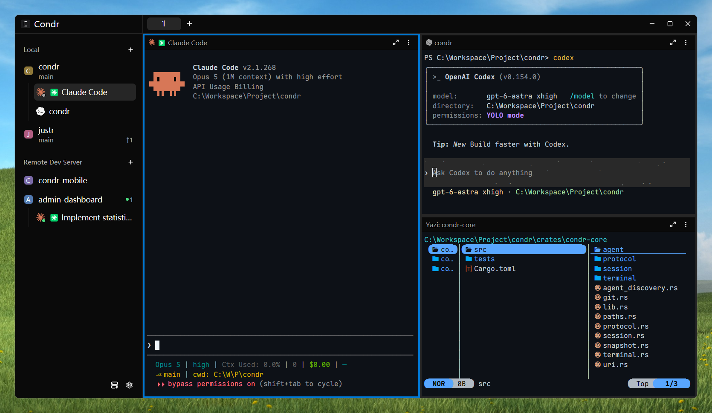

The Condr client renders the interface and handles interaction; terminal sessions, Agent processes and the window layout are all hosted by the background Server. Closing the window does not end running sessions.

---

## Window layout

The Condr interface has four areas:

### Title bar

| Control / state | Description |
| :--- | :--- |
| **Sidebar toggle** | Collapses or expands the left sidebar. Collapsed, it keeps only the Workspace initial icons. |
| **Tab bar** | Shows every Tab in the current Workspace. Click `+` to start a new shell in the current Pane's directory. |
| **Open in** | Opens the project root in an external editor or file manager (local Devices only; remembers each project's choice). |
| **Right sidebar toggle** | Shows or hides the right sidebar; the state is kept per Workspace. |

---

### Left sidebar

Manages Devices, project Workspaces and Agent state. Drag Devices or Workspaces to reorder them.

* **Needs you**: the list of things waiting for you. It appears at the top when an Agent needs confirmation or input; click a row to jump to its Pane.
* **Devices and connections**:
  * **Device groups**: Workspaces are grouped by Device (the local one shows as `Local`). The context menu connects and disconnects, and edits or deletes a remote Device.
  * **Status icons**: 🔴 red means not connected (click to reconnect); ⚠️ an amber triangle means the Device runs a different Condr version from this window.
  * **Connect Remote Device**: at the bottom; connects a remote Device over SSH, TCP or P2P.
* **Workspaces**:
  * Show the project icon, name and Git branch (`no git` outside a repository).
  * Status: when the branch is ahead of or behind upstream, the commit counts show as `↑N ↓N`.
  * Context menu: rename, create a Git worktree or close the Workspace.
* **Agent rows**: every Agent listed under its Workspace, with a badge on its icon for its live state.
* **Utilities**:
  * Coffee cup at the bottom: keeps the screen awake with one click.
  * Gear at the bottom: Settings (a red dot appears when a new version is available).

---

### Main area (Tabs and Panes)

* **Terminal Tabs**: each Tab holds a set of split Panes. Tabs are numbered and a shortcut jumps straight to each.
* **Review Tabs (Diff / Preview)**:
  * Opened by clicking a file in the right sidebar, to compare changes or preview source.
  * Each Workspace has at most one of each, reused for the next file so Tabs do not pile up.
* **Pane controls**:
  * **Title bar**: shows the Agent mark, the terminal title and the zoom / restore button.
  * **⋮ menu**: split, swap, zoom and close.
  * **Rearranging**: drag a Pane's title bar onto the center of another Pane to swap them, or onto an edge to split and dock there; drag the divider between Panes to resize them.

---

### Right sidebar

* **Files (project tree)**: browse the project's directories. Folders with changes carry a dot, and files ignored through `.gitignore` are greyed out. Click a file to view it in the Preview Tab.
* **Changes**: active in Git repositories only. Lists changed files with added and removed lines, grouped as `Conflicts`, `Tracked` and `Untracked`. Click a file to review it in the Diff Tab.
* **Context menu**: copy the relative or absolute path, insert the path into the terminal, or open the file in a local editor.

---

## Agent state indicators

Agent state shows in the **badges in the left sidebar**, the **Workspace counters** and the **Needs you** list.

| State | Meaning |
| :--- | :--- |
| **Working** | Running a task (thinking, generating text or calling tools). |
| **Blocked** | Waiting for your input or approval (listed in Needs you). |
| **Done** | Finished in the background. Resets to Idle once focus returns to its Pane. |
| **Idle** | Idle: the turn is over and it waits for the next instruction. |
| **Unknown** | A plain shell session, or an Agent without Condr hooks. |
| **Bell** | The terminal rang its bell (Bell takes priority over the regular lifecycle states). |

> **Tip**: when an Agent in the background finishes or becomes blocked, Condr sends a native system notification; clicking it goes straight to that Pane. To turn on state tracking, see [Agent integrations](/docs/using/agents/).

---

## Welcome page

Shown when a Device is connected but no Workspace is open yet, with **Open Project** and **Connect Remote Device** as shortcuts.

---

## Connection status

* **With no Workspace loaded**: the connection steps, troubleshooting advice and a retry button show in the centre.
* **With a Workspace loaded**: a status bar shows at the top of the Panes, hidden for the first 2 seconds of a reconnect.
* **While disconnected**: the Server keeps working in the background, and the window picks up its context and output once the network is back.

---

## Command line (CLI)

The `condr` command line exposes most of the window's features, for script automation and for Agents to call as a tool:

| Command group | Operates on |
| :--- | :--- |
| `condr workspace` | Workspace lifecycle: create, rename, focus, list or close. |
| `condr tab` | Tabs: create, rename, switch and close. |
| `condr pane` (layout) | Split, move, swap, resize and focus. |
| `condr pane` (I/O) | Send keys or commands, and capture and read a Pane's output. |
| `condr agent` | Find available Agents, install hooks, start an Agent in a Pane, send prompts and wait for the result. |
| `condr device` | List saved remote Devices and whether they are reachable. |
| `condr server` | Manage the local Server process (start, restart, pairing). |

### Scope rules
* **Inside a Pane's terminal**: bound to the current Workspace, Tab and Pane by default, with no context IDs needed.
* **In a system terminal**: connects straight to the local Server and needs the target IDs passed explicitly.
* **Remote operation**: add `--device <device name>` (host-level commands such as `server` and `agent hooks` run locally only).

---

## Suggested reading path

On first use, set up your workflow in this order:

1. **Environment and layout**: read [Workspaces, Tabs and Panes](/docs/using/workspaces/) to learn splits and isolated development with worktrees.
2. **Bring in Agents**: see [Agent integrations](/docs/using/agents/) and install hooks to turn on state sync.
3. **Files and code review**: see [Changes and file preview](/docs/using/changes/) for incremental review and diffs.
4. **Going further**:
   * For remote development, see [Remote connections](/docs/using/remote/) (SSH / TCP / P2P).
   * For multi-Agent collaboration, see [Agent automation](/docs/using/automation/).
   * For everyday shortcuts and external editors, see [Shortcuts and preferences](/docs/using/preferences/).
